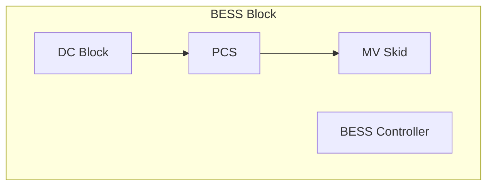

Battery Energy Storage Systems (BESS) are often described using terms such as DC Block, PCS, MV Skid, BESS Block, BESS Plant, BESS Controller, Battery Plant Controller, EMS,. To avoid confusion, this article lays out how these pieces fit together - from the core building block, the DC Block to a full Battery Energy Storage System plant with corresponding controls. The article is a series of Spotlight articles where we dive into the BESS nomenclature and terminology from our [📋 BESS Nomenclature Guide A-Z](https://www.besstology.com/posts/knowledge-base-nomenclature/).

---

## 📦 BESS Block  
A BESS Block is the functional building block of a plant, consisting of:  
- DC Block(s)  
- PCS(s)  
- MV Skid  
- BESS Controller  

### 🔋 DC Block  
The **DC Block** is the electrochemical core of the system. It contains battery cells packaged in modules and racks, typically housed in a cabinet or container format. Each block includes a Battery Management System (BMS), Fire Suppression System (FSS), and DC protection. In modular projects, multiple DC Blocks can be paired with PCS and MV Skids to scale capacity.

---

### ⚡ Power Conversion System (PCS)  
The **PCS** converts energy between AC and DC. It enables bidirectional power flow and provides control of active/reactive power, voltage, and frequency to meet grid and operational requirements.  

Advanced PCS platforms increasingly include **grid-forming capabilities**, enabling black start, islanded operation, and synthetic inertia support.

---

### 🏗️ Medium-Voltage (MV) Skid  
The **MV Skid** integrates a step-up transformer and medium-voltage switchgear, packaging the necessary equipment to connect PCS outputs to the grid. Some manufacturers combine PCS and MV Skid into a single containerized solution, often referred to as a **PCS & MV Skid**.

---

### 🖥️ BESS Controller  
The **BESS Controller** supervises operation of the DC Block(s) and PCS within a single BESS Block. It ensures coordinated charging, discharging, safety monitoring, and communication with higher-level controllers. This is the local “brain” of each block.

---

## 🏭 BESS Plant  
A **BESS Plant** aggregates multiple BESS Blocks and adds plant-level controls and supervision so the site behaves as one controllable grid resource.  

A BESS Plant includes:  
- Multiple BESS Blocks operating in parallel at the site MV bus  
- **Battery Plant Controller (BPC)** for plant-wide coordination and grid code compliance  
- **SCADA** for supervisory control, monitoring, alarms, historian, and operator HMI  
- Grid interconnection equipment and site Balance of Plant  

---

## 🌐 Battery Plant Controller (BPC)  
The **BPC** coordinates multiple BESS Blocks to operate as a unified power plant. It enforces grid-code compliance, manages dispatch setpoints across blocks, and integrates with SCADA for supervisory control.

---

## 🖧 SCADA (Supervisory Control and Data Acquisition)  
**SCADA** provides centralized monitoring, alarms, and operator interface for the full BESS Plant. It collects real-time data from the BPC and BESS Blocks, enabling remote operation, event logging, and coordination with the grid operator’s control center.

---

## 📊 Route-to-Market (RTM) Controller  
Above the BPC and SCADA sits the **RTM Controller**. It manages commercial dispatch, market bidding, and optimization across services (energy, capacity, ancillary markets). Depending on project setup, this function may be integrated into the BPC or provided by an external aggregator.

---

## 🔎 Hierarchy Overview  

- **DC Block + PCS + MV Skid + BESS Controller = BESS Block**  
- **Multiple BESS Blocks + BPC + SCADA = BESS Plant**  
- **BESS Plant + RTM Controller = Market-integrated Asset**
