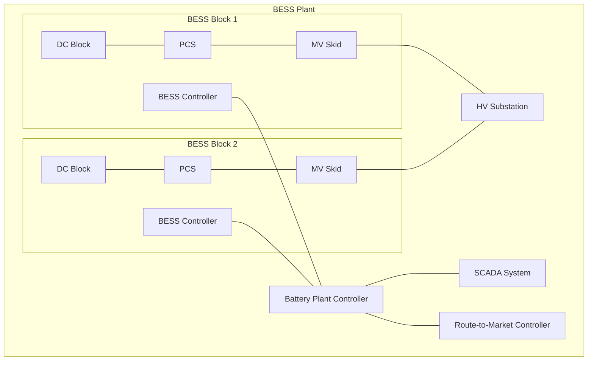

Battery Energy Storage Systems (BESS) are often described using terms such as AC Block, DC Block, PCS, MV Skid, BESS Block, BESS Plant, BESS Controller, Battery Plant Controller, EMS,. To avoid confusion, this article lays out how these pieces fit together - from the core DC Block to a full Battery Energy Storage System plant with corresponding controls. 

This article is a series of Spotlight articles where we dive into the BESS nomenclature and terminology from our [📋 BESS Nomenclature Guide A-Z](https://www.besstology.com/posts/knowledge-base-nomenclature/).

---

## BESS Block  
A BESS Block is the functional building block of a plant, consisting of:  
- DC Block(s)  
- PCS(s)  
- MV Skid  
- BESS Controller  

> An BESS Block can also be referred to as an AC Block if all the modular pieces are integrated together in a Cabinet or Container style format.
{: .prompt-info }
---

### DC Block  
The DC Block is the electrochemical core of the system. It contains battery cells packaged in modules and racks, typically housed in a cabinet or container format. Each block includes a Battery Management System (BMS), Fire Suppression System (FSS), and DC protection. In modular projects, multiple DC Blocks can be paired with PCS and MV Skids to scale capacity.

---

### Power Conversion System (PCS)  
The PCS converts energy between AC and DC. It enables bidirectional power flow and provides control of active/reactive power, voltage, and frequency to meet grid and operational requirements.  

---

### Medium-Voltage (MV) Skid  
The MV Skid typically integrates a step-up transformer and medium-voltage switchgear, packaging the necessary electrical infrastructure to connect PCS outputs to the grid. The PCS and MV Skid are often combined into a single containerized solution referred to as a PCS & MV Skid.

---

### BESS Controller  
The BESS Controller manages the interaction of the DC Block(s) and PCS within a single BESS Block. It handles charging and discharging control, safety monitoring, and communication with higher-level controllers.

---

## BESS Plant  
A BESS Plant aggregates multiple BESS Blocks and incorporates plant-level controls so the site operates as one dispatchable grid resource.  

A BESS Plant typically includes:  
- One or more BESS Blocks operating in parallel  
- Battery Plant Controller (BPC) for plant-wide coordination and grid code compliance  
- SCADA for supervisory control, monitoring, alarms, historian, and operator interface  
- Route-to-Market (RTM) Controller for commercial dispatch and revenue optimization (optional if functions are embedded in the BPC)

---

### Battery Plant Controller (BPC)  
The BPC coordinates multiple BESS Blocks to operate as a unified power plant. It enforces grid-code compliance, manages dispatch setpoints across blocks, and integrates with SCADA for supervisory control.

---

### SCADA (Supervisory Control and Data Acquisition)  
SCADA provides centralized monitoring, alarms, and operator interface for the full BESS Plant. It collects real-time data from the BPC and BESS Blocks, enabling remote operation, event logging, and coordination with the grid operator’s control center.

---

### Route-to-Market (RTM) Controller  
A controller used for commercial dispatch, asset scheduling, and revenue optimization. Its role depends on the capabilities of the Battery Plant Controller and may often be omitted if the Route-to-Market provider can interact directly with the Battery Plant Controller (BPC).

---

## Summary
From the DC Block as the electrochemical foundation, to the BESS Block as the functional unit, and finally the BESS Plant with plant-level controllers and SCADA - each layer builds on the previous one. A clear understanding of this hierarchy avoids confusion in project design and communication, ensuring consistency between developers, EPC contractors, service providers, and manufacturers.

Clear understanding of this hierarchy avoids confusion in project design and communication, ensuring consistency between developers, EPC Contractors, Service-level providers, and manufacturers.


